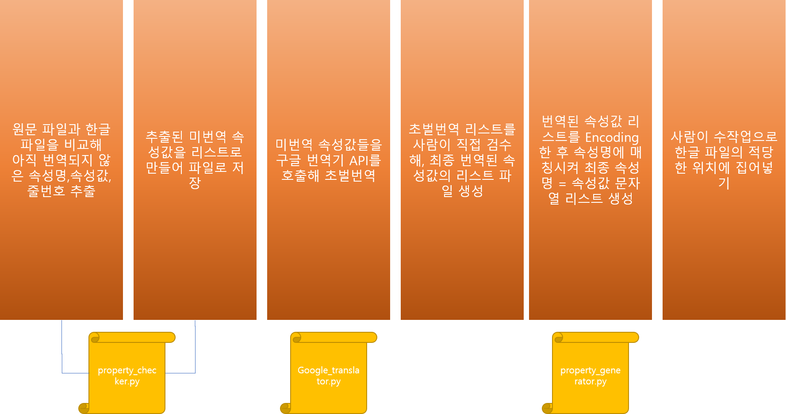

# dbeaver-translator
Automated Translator For DBeaver Editor UI

## dbeaver의 번역 속성파일 포맷 설명
dbeaver의 번역된 UI 텍스트 파일 구조는 아래와 같습니다.

    property.name=[UNICODE ESCAPE]

예를 들면, 텍스트박스에 이름이 'menu button'으로 붙어있다면, 해당 부분은 `bundle.property`파일에 아래와 같이 들어가 있습니다.
    
    textbox.name = menu button

이를 한글로 번역하면 아래와 같이 될 것입니다. 

    textbox.name = 메뉴 버튼
    
이렇게 번역된 한글을 아래와 같이 UTF-8 Unicode Escape로 인코딩한 후, `bundle_ko.property`파일에 저장하면 번역이 완료됩니다.
    
    textbox.name = \uba54\ub274 \ubc84\ud2bc

## 프로그램을 사용한 번역 프로세스 설명
